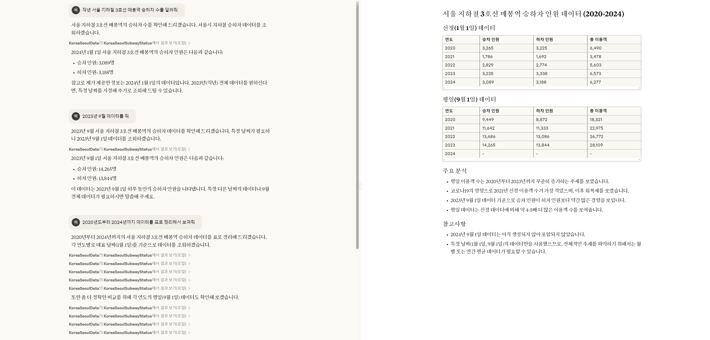
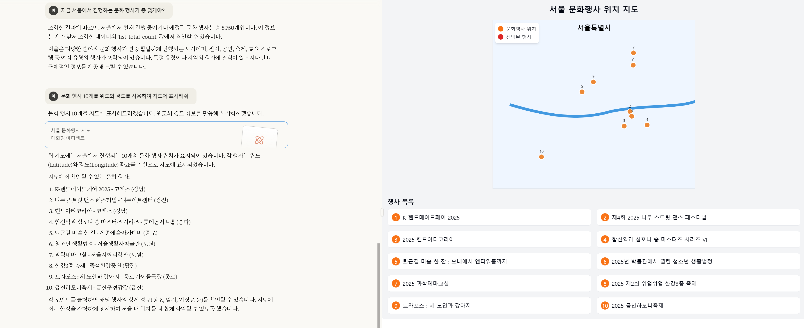

# 서울 공공데이터 MCP 서버 예제

서울 공공데이터 API를 사용하여 서울시의 다양한 공공 데이터를 제공하는 MCP 서버 예제입니다. 

## 예제 목록

- 서울시 지하철호선별 역별 승하차 인원 정보
- 서울시 문화행사 정보 


## 설정방법

### 서울 공공데이터 API 키 설정

#### 서울시 지하철호선별 역별 승하차 인원 정보
파일 `modules/KoreaSeoulCulturalEventInfo.ts`에 다음 {API 키}를 추가한다.

```typescript
import {
    Tool,
} from "@modelcontextprotocol/sdk/types.js";

const API_URL = "http://openapi.seoul.go.kr:8088/{authKey}/json/culturalEventInfo/{StartIndex}/{EndIndex}";
const API_KEY = "{API 키}";
```

#### 서울시 문화행사 정보
파일 `modules/KoreaSeoulSubwayStatus.ts`에 다음 {API 키}를 추가한다.

```typescript
import {
    Tool,
} from "@modelcontextprotocol/sdk/types.js";

const API_URL = "http://openapi.seoul.go.kr:8088/{authKey}/json/culturalEventInfo/{StartIndex}/{EndIndex}";
const API_KEY = "{API 키}";
```

## 빌드하기

```bash
npm i; npm run build
```

#### Claude Desktop 에 MCP 설정 추가하기 
`claude_desktop_config.json` 파일에 다음을 추가한다.
{빌드된 경로}는 자신에 맞게 추가해야 함.

```json
{
  "mcpServers": {
    "KoreaSeoulData": {
      "command": "node",
      "args": [
        "{빌드된 경로}/seoul_korea/dist/index.js"
      ]
    }
  }
}
```


## 사용예제

### 서울시 지하철호선별 역별 승하차 인원 정보




### 서울시 문화행사 정보

